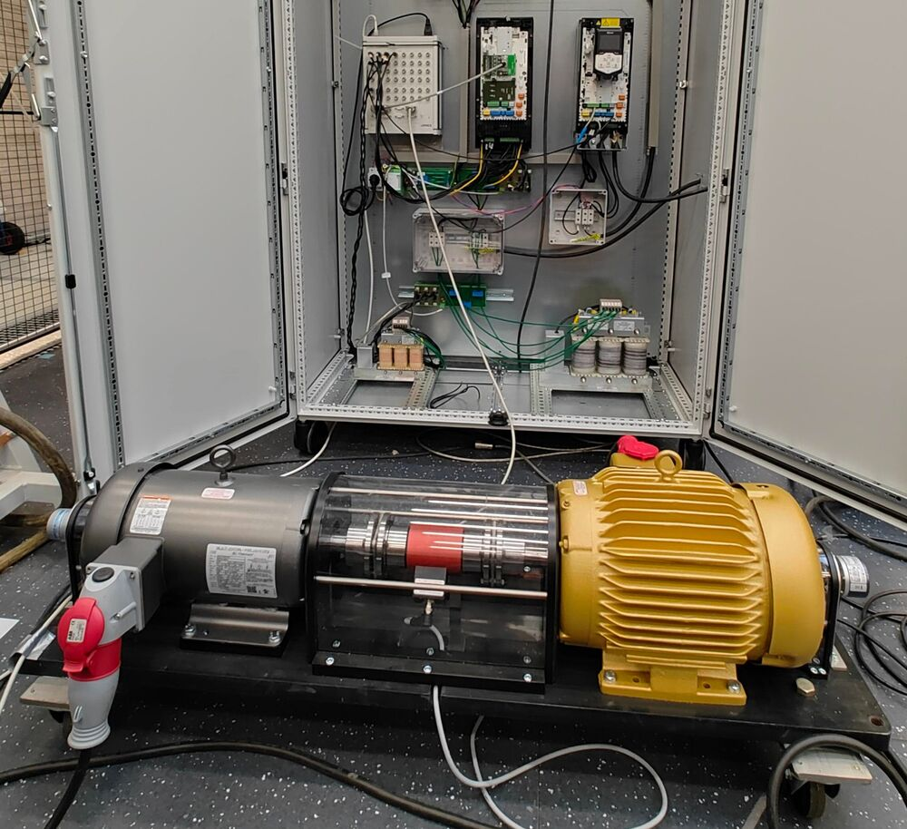

# motulator

**Motor drive and grid converter simulator in Python**

[](https://pypi.org/project/motulator/)
[](https://pypi.org/project/motulator/)
[](https://github.com/Aalto-Electric-Drives/motulator/actions/workflows/update_gh-pages.yml)
[](https://github.com/Aalto-Electric-Drives/motulator/blob/main/LICENSE)
[](https://zenodo.org/doi/10.5281/zenodo.10223090)
[](#contributors)

**[Documentation](https://aalto-electric-drives.github.io/motulator/)** ·
**[Drive examples](https://aalto-electric-drives.github.io/motulator/drive_examples/index.html)** ·
**[Grid examples](https://aalto-electric-drives.github.io/motulator/grid_examples/index.html)** ·
**[Installation](https://aalto-electric-drives.github.io/motulator/installation.html)**

<picture>
  <source media="(prefers-color-scheme: dark)" srcset=".github/assets/hero-dark.svg">
  
</picture>

*motulator* provides simulation models and control algorithms for electric machine drives and grid converter systems. The system models are simulated in the continuous-time domain, while the control algorithms run in discrete time, as they would in a real converter.

## Features

- **Machine models:** induction machines, synchronous reluctance machines, and permanent-magnet synchronous machines, including magnetic saturation and two-mass mechanics
- **Grid converter models:** L and LCL filters, inductive-resistive grids, and DC-bus dynamics
- **Drive control:** V/Hz control, current-vector and flux-vector control, sensorless observers, and signal injection
- **Grid converter control:** grid-following and grid-forming control, including disturbance-observer-based and power-synchronization methods
- **Ready-to-run examples** as Python scripts and Jupyter notebooks, including neural-network-based flux maps learned from measured data

## Installation

```bash
pip install motulator
```

To develop *motulator* itself, clone the repository as described in the [installation guide](https://aalto-electric-drives.github.io/motulator/installation.html).

## Quick start

A complete simulation takes about 20 lines. This example runs sensorless flux-vector control of a 2.2-kW interior permanent-magnet synchronous machine drive:

```python
import motulator.drive.control.sm as control
from motulator.drive import model, utils

# Continuous-time system model: 2.2-kW IPMSM, mechanics, and converter
par = model.SynchronousMachinePars(n_p=3, R_s=3.6, L_d=0.036, L_q=0.051, psi_f=0.545)
mdl = model.Drive(
    model.SynchronousMachine(par),
    model.MechanicalSystem(J=0.015),
    model.VoltageSourceConverter(u_dc=540),
)

# Discrete-time control system: sensorless flux-vector control
cfg = control.FluxVectorControllerCfg(i_s_max=6.5, sensorless=True)
ctrl = control.VectorControlSystem(
    control.FluxVectorController(par, cfg), control.SpeedController(J=0.015, alpha_s=25)
)

# Speed reference and load torque
ctrl.set_speed_ref(lambda t: (t > 0.1) * 50)  # rad/s
mdl.mechanics.set_external_load_torque(lambda t: (t > 0.7) * 10)  # Nm

res = model.Simulation(mdl, ctrl).simulate(t_stop=1.2)
utils.plot(res)
```

To go further, start from the [drive examples](https://aalto-electric-drives.github.io/motulator/drive_examples/index.html) and [grid examples](https://aalto-electric-drives.github.io/motulator/grid_examples/index.html). New system models and controllers can be developed using the existing ones as templates.

## From simulation to the laboratory



Almost all control methods in the examples have also been implemented and tested on laboratory test benches at Aalto University, such as the one shown here. The simulation models aim to capture the dynamics that matter for control design.

<br clear="right">

## Contributing

If you would like to help us develop *motulator*, see these [guidelines](https://aalto-electric-drives.github.io/motulator/contributing.html) first.

## Contributors

<details>
<summary>Thanks go to these wonderful people.</summary>

<!-- ALL-CONTRIBUTORS-LIST:START - Do not remove or modify this section -->

<!-- prettier-ignore-start -->

<!-- markdownlint-disable -->

<table>
  <tbody>
    <tr>
      <td align="center" valign="top" width="14.28%"><a href="https://github.com/lauritapio"><br /><sub><b>Lauri Tiitinen</b></sub></a><br /><a href="https://github.com/Aalto-Electric-Drives/motulator/commits?author=lauritapio" title="Code">💻</a> <a href="#ideas-lauritapio" title="Ideas, Planning, & Feedback">🤔</a> <a href="#example-lauritapio" title="Examples">💡</a> <a href="#mentoring-lauritapio" title="Mentoring">🧑‍🏫</a></td>
      <td align="center" valign="top" width="14.28%"><a href="https://github.com/HannuHar"><br /><sub><b>HannuHar</b></sub></a><br /><a href="https://github.com/Aalto-Electric-Drives/motulator/commits?author=HannuHar" title="Code">💻</a> <a href="https://github.com/Aalto-Electric-Drives/motulator/issues?q=author%3AHannuHar" title="Bug reports">🐛</a></td>
      <td align="center" valign="top" width="14.28%"><a href="https://research.aalto.fi/en/persons/marko-hinkkanen"><br /><sub><b>Marko Hinkkanen</b></sub></a><br /><a href="https://github.com/Aalto-Electric-Drives/motulator/commits?author=mhinkkan" title="Code">💻</a> <a href="#ideas-mhinkkan" title="Ideas, Planning, & Feedback">🤔</a> <a href="#example-mhinkkan" title="Examples">💡</a> <a href="#mentoring-mhinkkan" title="Mentoring">🧑‍🏫</a></td>
      <td align="center" valign="top" width="14.28%"><a href="https://github.com/silundbe"><br /><sub><b>silundbe</b></sub></a><br /><a href="https://github.com/Aalto-Electric-Drives/motulator/commits?author=silundbe" title="Code">💻</a> <a href="#example-silundbe" title="Examples">💡</a></td>
      <td align="center" valign="top" width="14.28%"><a href="https://github.com/JoonaKukkonen"><br /><sub><b>JoonaKukkonen</b></sub></a><br /><a href="https://github.com/Aalto-Electric-Drives/motulator/commits?author=JoonaKukkonen" title="Code">💻</a> <a href="#infra-JoonaKukkonen" title="Infrastructure (Hosting, Build-Tools, etc)">🚇</a></td>
      <td align="center" valign="top" width="14.28%"><a href="https://github.com/jarno-k"><br /><sub><b>jarno-k</b></sub></a><br /><a href="#ideas-jarno-k" title="Ideas, Planning, & Feedback">🤔</a> <a href="https://github.com/Aalto-Electric-Drives/motulator/pulls?q=is%3Apr+reviewed-by%3Ajarno-k" title="Reviewed Pull Requests">👀</a> <a href="#mentoring-jarno-k" title="Mentoring">🧑‍🏫</a></td>
      <td align="center" valign="top" width="14.28%"><a href="https://github.com/angelicaiaderosa"><br /><sub><b>angelicaiaderosa</b></sub></a><br /><a href="https://github.com/Aalto-Electric-Drives/motulator/commits?author=angelicaiaderosa" title="Code">💻</a> <a href="#example-angelicaiaderosa" title="Examples">💡</a></td>
    </tr>
    <tr>
      <td align="center" valign="top" width="14.28%"><a href="https://www.kth.se/profile/lucap"><br /><sub><b>Luca Peretti</b></sub></a><br /><a href="#ideas-lucaperetti" title="Ideas, Planning, & Feedback">🤔</a> <a href="#promotion-lucaperetti" title="Promotion">📣</a></td>
      <td align="center" valign="top" width="14.28%"><a href="https://github.com/GianmarioPellegrinoPolito"><br /><sub><b>GianmarioPellegrinoPolito</b></sub></a><br /><a href="#data-GianmarioPellegrinoPolito" title="Data">🔣</a></td>
      <td align="center" valign="top" width="14.28%"><a href="https://github.com/SimFerr"><br /><sub><b>Simone Ferrari</b></sub></a><br /><a href="#data-SimFerr" title="Data">🔣</a></td>
      <td align="center" valign="top" width="14.28%"><a href="https://github.com/Jialed0303"><br /><sub><b>Jialed0303</b></sub></a><br /><a href="#ideas-Jialed0303" title="Ideas, Planning, & Feedback">🤔</a></td>
      <td align="center" valign="top" width="14.28%"><a href="https://github.com/murgui"><br /><sub><b>murgui</b></sub></a><br /><a href="https://github.com/Aalto-Electric-Drives/motulator/issues?q=author%3Amurgui" title="Bug reports">🐛</a></td>
      <td align="center" valign="top" width="14.28%"><a href="https://github.com/iam-nithin-10"><br /><sub><b>Nithin Valiyaveettil Sadanandan</b></sub></a><br /><a href="https://github.com/Aalto-Electric-Drives/motulator/issues?q=author%3Aiam-nithin-10" title="Bug reports">🐛</a></td>
      <td align="center" valign="top" width="14.28%"><a href="https://github.com/saarela"><br /><sub><b>saarela</b></sub></a><br /><a href="https://github.com/Aalto-Electric-Drives/motulator/issues?q=author%3Asaarela" title="Bug reports">🐛</a></td>
    </tr>
    <tr>
      <td align="center" valign="top" width="14.28%"><a href="https://github.com/UshnishChowdhury"><br /><sub><b>Ushnish</b></sub></a><br /><a href="https://github.com/Aalto-Electric-Drives/motulator/issues?q=author%3AUshnishChowdhury" title="Bug reports">🐛</a></td>
      <td align="center" valign="top" width="14.28%"><a href="https://github.com/Francesco-Lelli"><br /><sub><b>Francesco-Lelli</b></sub></a><br /><a href="https://github.com/Aalto-Electric-Drives/motulator/commits?author=Francesco-Lelli" title="Code">💻</a> <a href="#example-Francesco-Lelli" title="Examples">💡</a> <a href="#ideas-Francesco-Lelli" title="Ideas, Planning, & Feedback">🤔</a></td>
      <td align="center" valign="top" width="14.28%"><a href="https://github.com/MiSaren"><br /><sub><b>Mikko Sarén</b></sub></a><br /><a href="https://github.com/Aalto-Electric-Drives/motulator/commits?author=MiSaren" title="Code">💻</a> <a href="#example-MiSaren" title="Examples">💡</a> <a href="#ideas-MiSaren" title="Ideas, Planning, & Feedback">🤔</a></td>
      <td align="center" valign="top" width="14.28%"><a href="https://github.com/maattaj11"><br /><sub><b>Juho Määttä</b></sub></a><br /><a href="https://github.com/Aalto-Electric-Drives/motulator/commits?author=maattaj11" title="Code">💻</a> <a href="#example-maattaj11" title="Examples">💡</a> <a href="#ideas-maattaj11" title="Ideas, Planning, & Feedback">🤔</a></td>
      <td align="center" valign="top" width="14.28%"><a href="https://github.com/rayanmour"><br /><sub><b>rayanmour</b></sub></a><br /><a href="https://github.com/Aalto-Electric-Drives/motulator/commits?author=rayanmour" title="Code">💻</a> <a href="#example-rayanmour" title="Examples">💡</a> <a href="#ideas-rayanmour" title="Ideas, Planning, & Feedback">🤔</a> <a href="https://github.com/Aalto-Electric-Drives/motulator/pulls?q=is%3Apr+reviewed-by%3Arayanmour" title="Reviewed Pull Requests">👀</a> <a href="#mentoring-rayanmour" title="Mentoring">🧑‍🏫</a></td>
      <td align="center" valign="top" width="14.28%"><a href="https://cusma.algo.xyz/"><br /><sub><b>Cosimo Bassi</b></sub></a><br /><a href="#infra-cusma" title="Infrastructure (Hosting, Build-Tools, etc)">🚇</a></td>
      <td align="center" valign="top" width="14.28%"><a href="https://github.com/Exiaolibur"><br /><sub><b>Junyi Li</b></sub></a><br /><a href="https://github.com/Aalto-Electric-Drives/motulator/commits?author=Exiaolibur" title="Code">💻</a> <a href="#example-Exiaolibur" title="Examples">💡</a> <a href="#ideas-Exiaolibur" title="Ideas, Planning, & Feedback">🤔</a></td>
    </tr>
    <tr>
      <td align="center" valign="top" width="14.28%"><a href="https://github.com/timfoissner"><br /><sub><b>Tim Foißner</b></sub></a><br /><a href="#data-timfoissner" title="Data">🔣</a> <a href="#ideas-timfoissner" title="Ideas, Planning, & Feedback">🤔</a></td>
    </tr>
  </tbody>
</table>

<!-- markdownlint-restore -->

<!-- prettier-ignore-end -->

<!-- ALL-CONTRIBUTORS-LIST:END -->

</details>

This project follows the [all-contributors](https://github.com/all-contributors/all-contributors) specification. Contributions of any kind welcome!

## Acknowledgement

This project has been sponsored by ABB Oy and by the Research Council of Finland *Centre of Excellence in High-Speed Electromechanical Energy Conversion Systems*. The example control methods included in this repository are based on published algorithms (available in textbooks and scientific articles). They do not present any proprietary control software.
