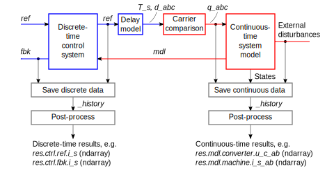
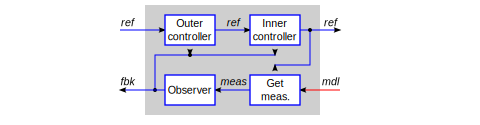

Common
======

Data Flow
---------

The two figures below shows the structure and data flow in a typical simulation model as well as an example of the internal structure of the discrete-time control system. The text in italics refers to the default object names used in the software. In the discrete-time control system, the signals are collected into the following SimpleNamespace objects:

- The object `fbk` contains feedback signals for the controllers. These signals can be measured quantities (such as the measured DC-bus voltage `fbk.u_dc`) as well as estimated quantities (such as the estimated stator flux linkage `fbk.psi_s`).

- The object `ref` contains the reference signals, both externally provided (such as `ref.w_m` for the angular speed reference) and internally generated (such as `ref.d_c_abc` for the duty ratios).

These objects `fbk` and `ref` may propagate through several blocks (implemented as classes in the software), which may add new signals or modify the existing one. At the end of their propagation chain, both objects `fbk` and `ref` are saved to the lists. Therefore, the most relevant internal signals of the control system are directly accessible after the simulation. Furthermore, the states and inputs of the continuous-time system model are also saved. In the post-processing stage, the saved data is converted to the NumPy arrays.

   Block diagram illustrating the structure and data flow in a typical simulation model. The lower part of the figure illustrates how the data is saved. The post-processing is done after the simulation. The internal structure of a typical control system is exemplified in the figure below.

   Block diagram exemplifying the internal structure of a typical cascade control system. The object `ref` at the controller output should contain the sampling period `T_s` and the converter duty ratios `d_c_abc` for the carrier comparison. The observer does not necessarily exist in all control systems (or it can be replaced with, e.g., a phase-locked loop).

Main Control Loop
-----------------

By default, discrete-time control systems run the following scheme in their main control loops:

1. Get the feedback signals `fbk` for the controllers from the outputs of the continuous-time system model `mdl`. This step may contain first getting the measurements and then optionally computing the observer outputs (or otherwise manipulating the measured signals).
2. Get the reference signals `ref` and compute the controller outputs based on the feedback signals `fbk`. Cascade control systems may contain multiple controllers, where the output of the outer controller is the reference signal for the inner controller.
3. Update the states of the control system for the next sampling instant.
4. Save the feedback signals `fbk` and the reference signals `ref` so they can be accessed after the simulation.
5. Return the sampling period `T_s` and the duty ratios `d_c_abc` for the carrier comparison.

A template of this main control loop is available in the base class for control systems in :class:`motulator.common.control.ControlSystem`. Using this template is not necessary, but it may simplify the implementation of new control systems.

2DOF PI Controller
------------------

Proportional-integral (PI) control is widely used in machine drives. A standard one-degree-of-freedom (1DOF) PI controller manipulates only the control error, i.e., it has single input and single output. Its two-degrees-of-freedom (2DOF) variants have two inputs (reference signal and feedback signal), which allows to design disturbance rejection and reference tracking separately [#Sko1996]_. The 2DOF PI controller is available in the :class:`motulator.common.control.PIController` class, which is the base class for the :class:`motulator.drive.control.SpeedController` and :class:`motulator.grid.control.DCBusVoltageController` classes.

Typical Structure
^^^^^^^^^^^^^^^^^

The figure below shows a 2DOF PI controller with an optional feedforward term. Its equivalent state-space form is given by

.. math::
	\frac{\mathrm{d} u_\mathrm{i}}{\mathrm{d} t} &= k_\mathrm{i}\left(r - y\right) \\
   u &= k_\mathrm{t}r - k_\mathrm{p}y + u_\mathrm{i} + u_\mathrm{ff}
   :label: 2dof_pi

where :math:`r` is the reference signal, :math:`y` is the measured (or estimated) feedback signal, :math:`u_\mathrm{i}` is the the integral state, and :math:`u_\mathrm{ff}` is the optional feedforward signal. Furthermore, :math:`k_\mathrm{t}` is the reference-feedforward gain, :math:`k_\mathrm{p}` is the proportional gain, and :math:`k_\mathrm{i}` is the integral gain. Setting :math:`k_\mathrm{t} = k_\mathrm{p}` and :math:`u_\mathrm{ff} = 0` results in the standard PI controller. This 2DOF PI controller can also be understood as a state feedback controller with integral action and reference feedforward [#Fra1997]_.

   2DOF PI controller with an optional feedforward term. The operator :math:`1/s` refers to integration. A discrete-time variant of this controller with the integrator anti-windup is implemented in the :class:`motulator.common.control.PIController` class.

Disturbance-Observer Structure
^^^^^^^^^^^^^^^^^^^^^^^^^^^^^^

The controller :eq:`2dof_pi` can be equally represented using the disturbance-observer structure as

.. math::
	\frac{\mathrm{d} u_\mathrm{i}}{\mathrm{d} t} &= \alpha_\mathrm{i}\left(u - \hat v\right) \\
   \hat v &= u_\mathrm{i} - (k_\mathrm{p} - k_\mathrm{t})y + u_\mathrm{ff} \\
   u &= k_\mathrm{t}\left(r - y\right) + \hat v
   :label: 2dof_pi_disturbance_observer

where :math:`\alpha_\mathrm{i} = k_\mathrm{i}/k_\mathrm{t}` is the redefined integral gain and :math:`\hat v` is the input-equivalent disturbance estimate. This structure is convenient to prevent the integral windup that originates from the actuator saturation [#Fra1997]_. The actuator output is limited in practice due to physical constraints. Consequently, the realized actuator output is

.. math::
   \bar{u} = \mathrm{sat}(u)

where :math:`\mathrm{sat}(\cdot)` is the saturation function. If this saturation function is known, the anti-windup of the integrator can be implemented simply as

.. math::
	\frac{\mathrm{d} u_\mathrm{i}}{\mathrm{d} t} = \alpha_\mathrm{i}\left(\bar{u} - \hat v \right)
   :label: anti_windup

The other parts of the above controller are not affected by the saturation.

Discrete-Time Algorithm
^^^^^^^^^^^^^^^^^^^^^^^

The discrete-time variant of the controller :eq:`2dof_pi_disturbance_observer` with the anti-windup in :eq:`anti_windup` is given by

.. math::
	u_\mathrm{i}(k+1) &= u_\mathrm{i}(k) + T_\mathrm{s} \alpha_\mathrm{i} \left[\bar{u}(k) - \hat v(k) \right] \\
   \hat v(k) &= u_\mathrm{i}(k) - (k_\mathrm{p} - k_\mathrm{t})y(k) + u_\mathrm{ff}(k) \\
   u(k) &= k_\mathrm{t}\left[r(k) - y(k)\right] + \hat v(k) \\
   \bar{u}(k) &= \mathrm{sat}[u(k)]
   :label: discrete_2dof_pi

where :math:`T_\mathrm{s}` is the sampling period and :math:`k` is the discrete-time index. This algorithm corresponds to the actual implementation in the :class:`motulator.common.control.PIController` class.

.. _complex-vector-2dof-pi-controller:

Complex-Vector 2DOF PI Controller
---------------------------------

As shown in the figure below, the 2DOF PI controller presented above can be extended for the control of complex-valued space vectors in a coordinate system rotating at the angular speed :math:`\omega` [#Bri1999]_. Depending on the control task, the controlled quantity is typically either a current vector or a flux linkage vector. In the continuous-time domain, the controller in the state-space form is given by

.. math::
	\frac{\mathrm{d} \boldsymbol{u}_\mathrm{i}}{\mathrm{d} t} &= (\boldsymbol{k}_\mathrm{i} + \mathrm{j}\omega \boldsymbol{k}_\mathrm{t})\left(\boldsymbol{r} - \boldsymbol{y}\right) \\
    \boldsymbol{u} &= \boldsymbol{k}_\mathrm{t}\boldsymbol{r} - \boldsymbol{k}_\mathrm{p}\boldsymbol{y} + \boldsymbol{u}_\mathrm{i} + \boldsymbol{u}_\mathrm{ff}
    :label: complex_vector_2dof_pi

where :math:`\boldsymbol{u}` is the output of the controller, :math:`\boldsymbol{r}` is the reference signal, :math:`\boldsymbol{u}_\mathrm{i}` is the the integral state, and :math:`\boldsymbol{u}_\mathrm{ff}` is the optional feedforward signal. Furthermore, :math:`\boldsymbol{k}_\mathrm{t}` is the reference-feedforward gain, :math:`\boldsymbol{k}_\mathrm{p}` is the proportional gain, and :math:`\boldsymbol{k}_\mathrm{i}` is the integral gain.

   2DOF complex-vector PI controller with an optional feedforward term.

The discrete-time implementation of :eq:`complex_vector_2dof_pi` with the anti-windup is given in the :class:`motulator.common.control.ComplexPIController` class, which is the base class for :class:`motulator.drive.control.sm.CurrentController`, :class:`motulator.drive.control.im.CurrentController`, and :class:`motulator.grid.control.CurrentController` classes. The algorithm is similar to the real-valued case given in :eq:`discrete_2dof_pi`.

.. rubric:: References

.. [#Sko1996] Skogestad, Postlethwaite, "Multivariable Feedback Control: Analysis and Design," West Sussex, England: John Wiley and Sons, 1996

.. [#Fra1997] Franklin, Powell, Workman, "Digital Control of Dynamic Systems," 3rd ed., Menlo Park, CA: Addison-Wesley, 1997

.. [#Bri1999] Briz del Blanco, Degner, Lorenz, “Dynamic analysis of current regulators for AC motors using complex vectors,” IEEE Trans.Ind. Appl., 1999, https://doi.org/10.1109/28.806058
