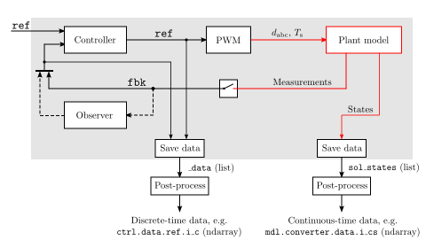

Common
======

Control System
--------------

The figure below shows the structure and data flow of the default control systems used in *motulator*.

   
   Block diagram of the control system. The continuous-time plant model is also shown in red. Please notice that the observer might not be present in all control systems.

In the figure, :math:`\texttt{monospace}` font is used to denote actual symbol names used in the program. The shaded background represents what is executed during the simulation, while the post-processing is done only after simulation. By default, discrete-time control systems run the following scheme in their main control loops:

   1. Get the feedback signals for the controllers. This step may contain first getting the measurements and then optionally computing the observer outputs. These measured and estimated signals are collected to the SimpleNamespace object named `fbk`. 
   2. Get the reference signals and compute the controller outputs based on the feedback signals `fbk`. These reference signals are collected to the SimpleNamespace object named `ref`. 
   3. Update the states of the control system for the next sampling instant.
   4. Save the feedback signals `fbk` and the reference signals `ref` so they can be accessed after the simulation.
   5. Return the sampling period `T_s` and the duty ratios `d_abc` for the carrier comparison.

A template of this main control loop is available in the base class for control systems in :class:`motulator.common.control.ControlSystem`. Using this template is not necessary, but it may simplify the implementation of new control systems.

PI Controller
-------------

The figure below shows a two-degree-of-freedom PI controller, where :math:`k_\mathrm{p}` and :math:`k_\mathrm{i}` are the proportional and integral gains, respectively. Furthermore :math:`u(s)` is the controller output, :math:`r(s)` is the reference signal, :math:`y(s)` is the feedback signal, and :math:`1/s` refers to integration. The controllers continous-time counterpart is:  

.. math:: 
   u(s) = k_{\mathrm{t}}\,r(s) - k_{\mathrm{p}}\,y(s) + \frac{k_{\mathrm{i}}}{s}\bigg(r(s) - y(s)\bigg)
   :label: 2DOFPI

.. figure:: figs/2dof_pi.svg
   :width: 100%
   :align: center
   :alt: Two-degree-of-freedom PI controller.

The standard PI 1DOF controller is obtained by choosing :math:`k_\mathrm{t} = k_\mathrm{p}`. The integrator anti-windup is implemented based on the realized controller output.

The PI controller is implemented in the class :class:`motulator.common.control.PIController`.

Complex-vector PI controller
----------------------------

The figure below shows a 2DOF synchronous-frame complex-vector PI controller which continuous-time counterpart of the controller is [#Bri2000]_:

.. math::
   \boldsymbol{u}(s) = \boldsymbol{k}_{\mathrm{t}}\,\boldsymbol{r}(s) 
   - \boldsymbol{k}_{\mathrm{p}}\, \boldsymbol{y}(s) + \frac{\boldsymbol{k}_{\mathrm{i}} + \mathrm{j}\omega \boldsymbol{k}_{\mathrm{t}}}{s}\bigg(\boldsymbol{r}(s) 
   - \boldsymbol{y}(s)\bigg) + \boldsymbol{u}_{\mathrm{ff}}(s)
   :label: complexFFPI

where :math:`\boldsymbol{u}(s)` is the controller output, :math:`\boldsymbol{r}(s)` is the reference signal, :math:`\boldsymbol{y}(s)` is the feedback signal, :math:`\boldsymbol{k}_{\mathrm{t}}` is the feedforward gain, :math:`\boldsymbol{k}_{\mathrm{p}}` and :math:`\boldsymbol{k}_{\mathrm{i}}` are the proportional and integral gains, respectively, and :math:`\boldsymbol{u}_{\mathrm{ff}}(s)` is the optional feedforward signal. 

.. figure:: figs/complex_vector_2dof_pi.svg
   :width: 100%
   :align: center
   :alt: Two-degree-of-freedom complex-vector PI controller, with feedforward.

The complex-vector PI controller with feedforward is implemented in the class :class:`motulator.common.control.ComplexPIController`.

.. rubric:: References

.. [#Bri2000] Briz, Degner, Lorenz, "Analysis and design of current regulators using complex vectors," IEEE Trans. Ind. Appl., 2000, https://doi.org/10.1109/28.845057