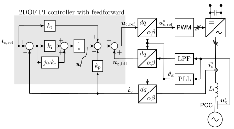

Current Control
===============
The grid-following control implemented in *motulator* uses a current controller
in which the normal two-degrees-of-freedom PI controller is extended
with a additional feedforward signal. This improves the performance since in reality the voltages 
of the grid are not perfect three-phase sine waves. The block diagram of the
2DOF feedforward PI current controller is shown in the figure below.

   
   2DOF PI controller, with filtered feedforward signal.

In this implementation a discrete-time 2DOF synchronous-frame complex-vector PI
controller similar to [#Bri2000]_ is used with an additional feedforward signal.
The continuous-time counterpart of the controller is

.. math::     
    \boldsymbol{u}_\mathrm{c,ref} = k_\mathrm{t} \boldsymbol{i}_\mathrm{c,ref} - k_\mathrm{p} \boldsymbol{i}_\mathrm{c} + (\boldsymbol{i}_{\mathrm{c,ref}} - \boldsymbol{i}_\mathrm{c})(k_\mathrm{i} + j \omega k_\mathrm{t})  \frac{1}{s} + \boldsymbol{u}_\mathrm{g,filt} 
    :label: ComplexFFPI

where :math:`\boldsymbol{u}_\mathrm{c,ref}` is the reference voltage, :math:`k_\mathrm{p}` and :math:`k_\mathrm{i}` are the proportional and integral gains,
:math:`k_t` is reference-feedforward gain, :math:`\boldsymbol{i}_\mathrm{c,ref}` is the reference current, :math:`\boldsymbol{i}_\mathrm{c}` is the measured current, 
:math:`\boldsymbol{u}_\mathrm{g,filt}` is the filtered feedforward grid voltage.

The complex-vector design gains are calculated as

.. math::                
    k_\mathrm{p} = 2\hat{L}_\mathrm{f}\alpha_\mathrm{c} \qquad\qquad
    k_\mathrm{i} = \hat{L}_\mathrm{f}\alpha_\mathrm{c}^2  \qquad \qquad
    k_\mathrm{t} = \hat{L}_\mathrm{f}\alpha_\mathrm{c} 
    :label: ComplexPI_gains

Where :math:`\hat{L}_\mathrm{f}` is the estimate of the filter inductance and :math:`\alpha_\mathrm{c}` the Closed-loop bandwidth (rad/s) of the current controller. Notice that selecting :math:`k_\mathrm{t} = k_\mathrm{p}` yields the standard (1DOF) PI controller.

The synchronization to the grid is done by a phase-locked loop (PLL) or by a power-synchronization loop (PSL) 
and the grid voltage angle estimate :math:`\hat{\vartheta}_\mathrm{g}` is calculated either by the PLL or by the PSL. 
This algorithm is compatible with both real and complex signals. 
The integrator anti-windup is implemented based on the realized controller output.

This controller is implemented in the class :class:`motulator.common.control.ComplexPIController`.

.. rubric:: References

.. [#Bri2000] Briz, Degner, Lorenz, "Analysis and design of current 
       regulators using complex vectors," IEEE Trans. Ind. Appl., 2000,
       https://doi.org/10.1109/28.845057
