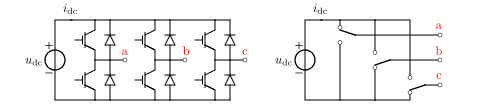
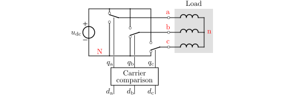
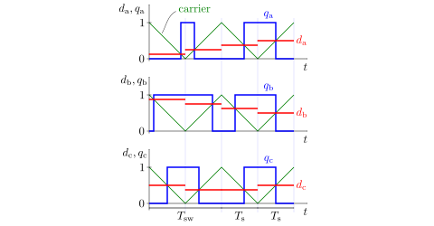

Converters
==========

Models of power converters are given in the module :mod:`motulator.model.converter`. 

Inverter With Carrier Comparison
--------------------------------

The figure below shows a three-phase two-level inverter and its equivalent model, where ideal switches  are assumed.

   Three-phase two-level inverter: (left) main circuit; (right) equivalent model. The DC-bus voltage and currents are :math:`u_\mathrm{dc}` and :math:`i_\mathrm{dc}`, respectively.

The states of the changeover switches are denoted by :math:`q_\mathrm{a}`, :math:`q_\mathrm{b}`, and :math:`q_\mathrm{c}`. Each changeover switch is connected to either negative or positive potential of the DC bus. The switchings are assumed to be infinitely fast.

   Instantaneous switching states are defined by the carrier comparison. In this example, the switching states are :math:`q_\mathrm{a}=1`, :math:`q_\mathrm{b}=0`, and :math:`q_\mathrm{c}=0`.

The figure below shows the principle of the carrier comparison. This logic is implemented in the class :class:`motulator.model.converter.PWMInverter`. Instead of searching for zero crossings, the switching instants are explicilty computed in the begininning of each sampling period, allowing faster simulations.

   Carrier comparison. The duty ratios are :math:`d_\mathrm{a}`, :math:`d_\mathrm{b}`, and :math:`d_\mathrm{c}` are constant over the sampling period :math:`T_\mathrm{s}` (or, optionally, over the the switching period :math:`T_\mathrm{sw}=2T_\mathrm{s}`). The carrier signal is the same for all three phases and varies between 0 and 1.

The zero-sequence voltage does not affect the phase currents if the neutral of the load is not connected. Therefore, the reference potential of the phase voltages can be freely chosen when computing the space vector of the converter output voltage. The converter voltage vector in stationary coordinates is

.. math::
	\boldsymbol{u} &= \frac{2}{3}\left(u_\mathrm{an} + u_\mathrm{bn}\mathrm{e}^{\mathrm{j}2\pi/3} + u_\mathrm{cn}\mathrm{e}^{\mathrm{j} 4\pi/3}\right) \\
	&= \frac{2}{3}\left(u_\mathrm{aN} + u_\mathrm{bN}\mathrm{e}^{\mathrm{j} 2\pi/3} + u_\mathrm{cN}\mathrm{e}^{\mathrm{j} 4\pi/3}\right) \\
    &= \underbrace{\frac{2}{3}\left(q_\mathrm{a} + q_\mathrm{b}\mathrm{e}^{\mathrm{j} 2\pi/3} + q_\mathrm{c}\mathrm{e}^{\mathrm{j} 4\pi/3}\right)}_{\boldsymbol{q}}u_\mathrm{dc}

where :math:`\boldsymbol{q}` is the switching state space vector. 

.. note::
   The carrier comparison is compatible with all standard pulse-width modulation (PWM) methods, such as space-vector PWM (see :class:`motulator.control.common.PWM`) and discontinuous PWM methods [1]_. If needed, the sampling period :math:`T_\mathrm{s}` can also vary. 

   If the zero sequence is of interest, it could be easily added to the inverter model.

   Since the converter models invariably are in stationary coordinates, the space vectors are not marked with the superscript s here to simplify the notation.

Switching-Cycle-Averaged Inverter
---------------------------------

If the switching ripple is not of interest in simulations, the carrier comparison can be replaced with zero-order hold of the duty ratios. In this case, the output voltage vector is

.. math::
	\boldsymbol{u} = \underbrace{\frac{2}{3}\left(d_\mathrm{a} + d_\mathrm{b}\mathrm{e}^{\mathrm{j} 2\pi/3} + d_\mathrm{c}\mathrm{e}^{\mathrm{j} 4\pi/3}\right)}_{\boldsymbol{d}}u_\mathrm{dc}

where :math:`\boldsymbol{d}` is the duty ratio space vector. The class :class:`motulator.model.converter.Inverter` implements this switching-cycle-averaged model of the inventer.

Six-Pulse Diode Bridge
----------------------

The figure below shows a six-pulse diode bridge rectifier, where the inductor :math:`L` and the capacitor :math:`C` are placed in the DC link. For simplicity, a three-phase supply voltage is assumed to be stiff. The class :class:`motulator.model.converter.FrequencyConverter` applies this model as a part of a frequency converter model.

   Six-pulse diode bridge rectifier.

References
----------

.. [1] Hava, Kerkman, Lipo, "Simple analytical and graphical methods for carrier-based PWM-VSI drives," IEEE Trans. Ind. Appl., 1999, https://doi.org/10.1109/63.737592