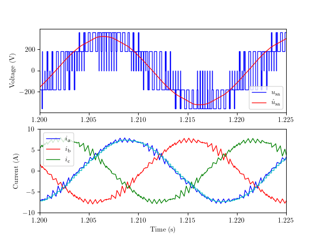

*motulator*: Open-Source Simulator for Motor Drives and Power Converters
========================================================================

.. toctree::
   :maxdepth: 1

   usage
   tutorial

This software includes simulation models for an induction motor, a synchronous reluctance motor, and a permanent-magnet synchronous motor. Furthermore, some simple control algorithms are included as examples. The motor models are simulated in the continuous-time domain while the control algorithms run in discrete time. The default solver is the explicit Runge-Kutta method of order 5(4) from `scipy.integrate.solve_ivp`_.

.. _scipy.integrate.solve_ivp: https://docs.scipy.org/doc/scipy/reference/generated/scipy.integrate.solve_ivp.html

Some interfaces may change in the later versions. The example control algorithms aim to be simple yet feasible, and they have not been optimized.

.. image:: pmsm.png
   :width: 320 px
   :alt: Speed and torque waveforms

Indices
-------

* :ref:`genindex`
* :ref:`modindex`
* :ref:`search`

Acknowledgement
---------------

This open-source project has been sponsored by ABB Oy. The example control methods included in this repository are based on published algorithms (available in textbooks and scientific articles). They do not present any proprietary control software.
