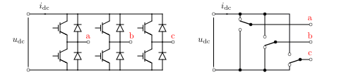
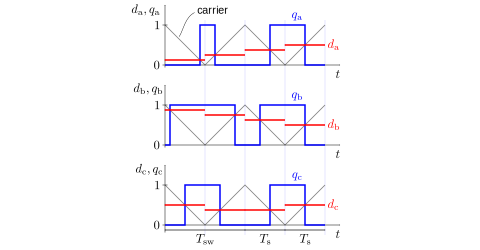

Converters
==========

Voltage-Source Converter
------------------------

The figure below shows a three-phase two-level voltage-source converter and its equivalent model, where ideal switches are assumed. This converter can operate both as an inverter and a rectifier, depending on the direction of the power flow. In the equivalent model, each changeover switch is connected to either negative or positive potential of the DC bus. The switching phenomena are assumed to be infinitely fast. The converter model is provided in the class :class:`motulator.drive.model.VoltageSourceConverter`. 

   Three-phase two-level voltage-source converter: (left) main circuit; (right) equivalent model. The DC-bus voltage and currents are :math:`u_\mathrm{dc}` and :math:`i_\mathrm{dc}`, respectively.

Six-Pulse Diode Bridge
----------------------

The figure below shows a six-pulse diode bridge rectifier, where the inductor :math:`L` and the capacitor :math:`C` are placed in the DC link. For simplicity, a three-phase supply voltage is assumed to be stiff. The class :class:`motulator.drive.model.FrequencyConverter` applies this model as a part of a frequency converter model.

   Six-pulse diode bridge rectifier.

Carrier Comparison
------------------

The figure below shows a converter equipped with a generic three-phase load. In pulse-width modulation (PWM), carrier comparison is commonly used to generate instantaneous switching state signals :math:`q_\mathrm{a}`, :math:`q_\mathrm{b}`, and :math:`q_\mathrm{c}` from duty ratios :math:`d_\mathrm{a}`, :math:`d_\mathrm{b}`, and :math:`d_\mathrm{c}`. The duty ratios are continuous signals in the range [0, 1} while the switching states are either 0 or 1.

.. figure:: figs/pwm_inverter.svg
   :width: 100%
   :align: center
   :alt: Voltage-source converter and carrier comparison
   :target: .

   Instantaneous switching states are defined by the carrier comparison. In this example, the switching states are :math:`q_\mathrm{a}=1`, :math:`q_\mathrm{b}=0`, and :math:`q_\mathrm{c}=0`.

The figure below shows the principle of carrier comparison. The logic shown in the figure is implemented in the class :class:`motulator.drive.model.CarrierComparison`, where the switching instants are explicitly computed in the beginning of each sampling period (instead of searching for zero crossings), allowing faster simulations.

   Carrier comparison. The duty ratios are :math:`d_\mathrm{a}`, :math:`d_\mathrm{b}`, and :math:`d_\mathrm{c}` are constant over the sampling period :math:`T_\mathrm{s}` (or, optionally, over the the switching period :math:`T_\mathrm{sw}=2T_\mathrm{s}`). The carrier signal is the same for all three phases and varies between 0 and 1.

The zero-sequence voltage does not affect the phase currents if the neutral of the load is not connected. Therefore, the reference potential of the phase voltages can be freely chosen when computing the space vector of the converter output voltage. The converter voltage vector in stationary coordinates is

.. math::
	\boldsymbol{u}_\mathrm{c}^\mathrm{s} &= \frac{2}{3}\left(u_\mathrm{an} + u_\mathrm{bn}\mathrm{e}^{\mathrm{j}2\pi/3} + u_\mathrm{cn}\mathrm{e}^{\mathrm{j} 4\pi/3}\right) \\
	&= \frac{2}{3}\left(u_\mathrm{aN} + u_\mathrm{bN}\mathrm{e}^{\mathrm{j} 2\pi/3} + u_\mathrm{cN}\mathrm{e}^{\mathrm{j} 4\pi/3}\right) \\
   &= \underbrace{\frac{2}{3}\left(q_\mathrm{a} + q_\mathrm{b}\mathrm{e}^{\mathrm{j} 2\pi/3} + q_\mathrm{c}\mathrm{e}^{\mathrm{j} 4\pi/3}\right)}_{\boldsymbol{q}_\mathrm{c}^\mathrm{s}}u_\mathrm{dc}
   :label: carrier_comparison
    
where :math:`\boldsymbol{q}_\mathrm{c}^\mathrm{s}` is the switching-state space vector.

.. note::
   The carrier comparison is compatible with all standard pulse-width modulation (PWM) methods, such as space-vector PWM (see :class:`motulator.common.control.PWM`) and discontinuous PWM methods [#Hol1994]_, [#Hav1999]_.

   The sampling period :math:`T_\mathrm{s}` is returned by the control method, and it does not need to be constant. 

   If the zero sequence is of interest, it could be easily added to the inverter model.

Switching-Cycle Averaging
-------------------------

If the switching ripple is not of interest in simulations, the carrier comparison can be replaced with zero-order hold (ZOH) of the duty ratios. In this case, the output voltage vector is

.. math::
	\boldsymbol{u}_\mathrm{c}^\mathrm{s} = \underbrace{\frac{2}{3}\left(d_\mathrm{a} + d_\mathrm{b}\mathrm{e}^{\mathrm{j} 2\pi/3} + d_\mathrm{c}\mathrm{e}^{\mathrm{j} 4\pi/3}\right)}_{\boldsymbol{d}_\mathrm{c}^\mathrm{s}}u_\mathrm{dc}
   :label: switching_cycle_averaging

where :math:`\boldsymbol{d}_\mathrm{c}^\mathrm{s}` is the duty ratio space vector. This ZOH is the default option in most of :doc:`/auto_examples/index`.

.. rubric:: References

.. [#Hol1994] Holtz, "Pulsewidth modulation for electronic power conversion," Proc. IEEE, 1994, https://doi.org/10.1109/5.301684

.. [#Hav1999] Hava, Kerkman, Lipo, "Simple analytical and graphical methods for carrier-based PWM-VSI drives," IEEE Trans. Ind. Appl., 1999, https://doi.org/10.1109/63.737592