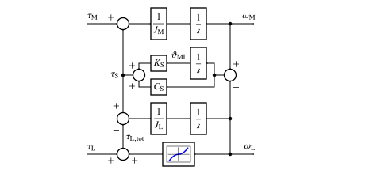

Mechanics
=========

Stiff Mechanical System
-----------------------

The dynamics of a stiff rotational mechanical system are governed by

.. math::
    J\frac{\mathrm{d}\omega_\mathrm{M}}{\mathrm{d} t} &= \tau_\mathrm{M} - B_\mathrm{L}\omega_\mathrm{M} - \tau_\mathrm{L} \\
    \frac{\mathrm{d}\vartheta_\mathrm{M}}{\mathrm{d} t} &= \omega_\mathrm{M}
    :label: mech_stiff

where :math:`\omega_\mathrm{M}` is the mechanical angular speed of the rotor, :math:`\vartheta_\mathrm{M}` is the mechanical angle of the rotor, :math:`\tau_\mathrm{M}` is the electromagnetic torque, :math:`\tau_\mathrm{L}` is the external load torque as a function of time, :math:`B_\mathrm{L}` is the friction coefficient, and :math:`J` is the total moment of inertia. The total load torque is

.. math::
    \tau_\mathrm{L,tot} = B_\mathrm{L}\omega_\mathrm{M} + \tau_{\mathrm{L}}
    :label: total_load_torque

A constant friction coefficient :math:`B_\mathrm{L}` models viscous friction that appears, e.g., due to laminar fluid flow in bearings. The friction coefficient is allowed to depend on the rotor speed, :math:`B_\mathrm{L} = B_\mathrm{L}(\omega_\mathrm{M})`. As an example, the quadratic load torque profile is achieved choosing :math:`B_\mathrm{L} = k|\omega_\mathrm{M}|`, where :math:`k` is a constant. The quadratic load torque appears, e.g., in pumps and fans as well as in vehicles moving at higher speeds due to air resistance. The model of a stiff mechanical system is provided in the class :class:`motulator.drive.model.StiffMechanicalSystem`. 

   Block diagram of a stiff mechanical system.

Two-Mass Mechanical System
--------------------------

A two-mass mechanical system can be modeled as

.. math::
    J_\mathrm{M}\frac{\mathrm{d}\omega_\mathrm{M}}{\mathrm{d} t} &= \tau_\mathrm{M} - \tau_\mathrm{S} \\
    J_\mathrm{L}\frac{\mathrm{d}\omega_\mathrm{L}}{\mathrm{d} t} &= \tau_\mathrm{S} - \tau_\mathrm{L} \\
    \frac{\mathrm{d}\vartheta_\mathrm{ML}}{\mathrm{d} t} &= \omega_\mathrm{M} - \omega_\mathrm{L}
    :label: mech_two_mass

where :math:`\omega_\mathrm{L}` is the angular speed of the load, :math:`\vartheta_\mathrm{ML}=\vartheta_\mathrm{M}-\vartheta_\mathrm{L}` is the twist angle, :math:`J_\mathrm{M}` is the moment of inertia of the machine, and :math:`J_\mathrm{L}` is the moment of inertia of the load. The shaft torque is 

.. math::
    \tau_\mathrm{S} = K_\mathrm{S}\vartheta_\mathrm{ML} + C_\mathrm{S}(\omega_\mathrm{M} - \omega_\mathrm{L})
    :label: shaft_torque

where :math:`K_\mathrm{S}` is the torsional stiffness of the shaft, and :math:`C_\mathrm{S}` is the torsional damping of the shaft. The other quantities correspond to those defined for the stiff mechanical system. A two-mass mechanical system is modeled in the class :class:`motulator.drive.model.TwoMassMechanicalSystem`. See also the example in :doc:`/drive_examples/obs_vhz/plot_obs_vhz_ctrl_pmsm_2kw_two_mass`.

   Block diagram of a two-mass mechanical system.

Externally Specified Rotor Speed
--------------------------------

It is also possible to omit the mechanical dynamics and directly specify the actual rotor speed :math:`\omega_\mathrm{M}` as a function of time, see the class :class:`motulator.drive.model.ExternalRotorSpeed`. This feature is typically needed when torque-control mode is studied, see the example :doc:`/drive_examples/vector/plot_vector_ctrl_im_2kw_tq_mode`.