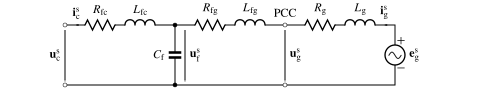

AC Filter and Grid Impedance
============================

This document describes continuous-time alternating current (AC) filter and grid-impedance models. 

L Filter 
--------

A dynamic model for an inductive L filter and inductive-resistive grid impedance is implemented in the class :class:`motulator.grid.model.LFilter`. The model is implemented in stationary coordinates as

.. math::
   \frac{\mathrm{d}\boldsymbol{i}_\mathrm{g}^\mathrm{s}}{\mathrm{d} t} 
   = \frac{1}{L_\mathrm{t}}(\boldsymbol{u}_\mathrm{c}^\mathrm{s} 
   - \boldsymbol{e}_\mathrm{g}^\mathrm{s} 
   - R_\mathrm{t}\boldsymbol{i}_\mathrm{g}^\mathrm{s})
   :label: L_filt_model

where :math:`\boldsymbol{i}_\mathrm{g}^\mathrm{s}` is the grid current, :math:`\boldsymbol{u}_\mathrm{c}^\mathrm{s}` is the converter voltage, :math:`\boldsymbol{e}_\mathrm{g}^\mathrm{s}` is the grid voltage, :math:`R_\mathrm{t} = R_\mathrm{fc} + R_\mathrm{g}` is the total resistance comprising the filter series resistance :math:`R_\mathrm{fc}` and the grid resistance :math:`R_\mathrm{g}`, and :math:`L_\mathrm{t} = L_\mathrm{fc} + L_\mathrm{g}` is the total inductance comprising the filter inductance :math:`L_\mathrm{fc}` and the grid inductance :math:`L_\mathrm{g}`. The point of common coupling (PCC) is modeled to be between the L filter and grid impedance. The voltage at the PCC is obtained as

.. math::
   \boldsymbol{u}_\mathrm{g}^\mathrm{s} 
   = \frac{L_\mathrm{g}(\boldsymbol{u}_\mathrm{c}^\mathrm{s} 
   - R_\mathrm{fc}\boldsymbol{i}_\mathrm{g}^\mathrm{s})
   + L_\mathrm{fc}(\boldsymbol{e}_\mathrm{g}^\mathrm{s} 
   + R_\mathrm{g}\boldsymbol{i}_\mathrm{g}^\mathrm{s})}{L_\mathrm{t}}
   :label: L_filt_PCC_voltage

   
   L filter and inductive-resistive grid impedance.

LCL Filter
----------

A dynamic model for an inductive-capacitive-inductive (LCL) filter and inductive-resistive grid impedance is implemented in the class :class:`motulator.grid.model.LCLFilter`. The model is implemented in stationary coordinates as

.. math::
   \frac{\mathrm{d}\boldsymbol{i}_\mathrm{c}^\mathrm{s}}{\mathrm{d} t} 
   &= \frac{1}{L_\mathrm{fc}}(\boldsymbol{u}_\mathrm{c}^\mathrm{s} 
   - \boldsymbol{u}_\mathrm{f}^\mathrm{s} 
   - R_\mathrm{fc}\boldsymbol{i}_\mathrm{c}^\mathrm{s})\\
   \frac{\mathrm{d}\boldsymbol{u}_\mathrm{f}^\mathrm{s}}{\mathrm{d} t} 
   &= \frac{1}{C_\mathrm{f}}(\boldsymbol{i}_\mathrm{c}^\mathrm{s} 
   - \boldsymbol{i}_\mathrm{g}^\mathrm{s})\\
   \frac{\mathrm{d}\boldsymbol{i}_\mathrm{g}^\mathrm{s}}{\mathrm{d} t} 
   &= \frac{1}{L_\mathrm{t}}(\boldsymbol{u}_\mathrm{f}^\mathrm{s} 
   - \boldsymbol{e}_\mathrm{g}^\mathrm{s} 
   - R_\mathrm{t}\boldsymbol{i}_\mathrm{g}^\mathrm{s})
   :label: LCL_filt_model

where :math:`\boldsymbol{i}_\mathrm{c}^\mathrm{s}` is the converter-side and :math:`\boldsymbol{i}_\mathrm{g}^\mathrm{s}` is the grid-side current of the LCL filter (i.e., converter and grid current, respectively), and :math:`\boldsymbol{u}_\mathrm{f}^\mathrm{s}` is the filter capacitor voltage. The converter-side and grid-side inductances of the LCL filter are :math:`L_\mathrm{fc}` and :math:`L_\mathrm{fg}`, and their series resistances are :math:`R_\mathrm{fc}` and :math:`R_\mathrm{fg}`, respectively. The filter capacitance is :math:`C_\mathrm{f}`. In the LCL filter model, the total grid-side indutance and resistance are :math:`L_\mathrm{t} = L_\mathrm{fg} + L_\mathrm{g}` and :math:`R_\mathrm{t} = R_\mathrm{fg} + R_\mathrm{g}`, respectively.

The PCC is modeled to be between the LCL filter and the inductive-resistive grid impedance (:math:`L_\mathrm{g}`, :math:`R_\mathrm{g}`). The voltage at the PCC is obtained as

.. math::
   \boldsymbol{u}_\mathrm{g}^\mathrm{s} 
   = \frac{L_\mathrm{g}(\boldsymbol{u}_\mathrm{f}^\mathrm{s} 
   - R_\mathrm{fg}\boldsymbol{i}_\mathrm{g}^\mathrm{s})
   + L_\mathrm{fg}(\boldsymbol{e}_\mathrm{g}^\mathrm{s} 
   + R_\mathrm{g}\boldsymbol{i}_\mathrm{g}^\mathrm{s})}{L_\mathrm{t}}
   :label: LCL_filt_PCC_voltage

   
   LCL filter and inductive-resistive grid impedance.
