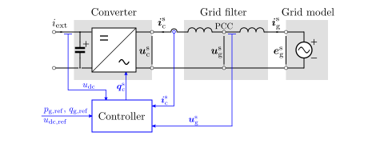

System Model
============

The figure below shows an example grid converter system. The different subsystems of the continuous-time system model are drawn with a shaded background. Typically, the subsystems include an inverter model, an output filter and grid impedance model, and a grid voltage source model. The figure also shows the point of common coupling (PCC) between the converter output filter and grid impedance.

In the figure, a generic discrete-time controller is shown in blue, along with the reference and feedback signals that are relevant in grid converter applications. Not all signals are used in a given control system, however. For example, the DC-bus voltage reference :math:`u_\mathrm{dc,ref}` is required if the control system includes a DC-bus voltage controller, otherwise the active power reference :math:`p_\mathrm{g,ref}` is directly given.

   Diagram of a grid converter system. Discrete-time sampled signals are shown in blue. 

