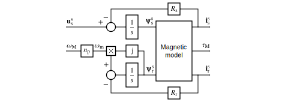
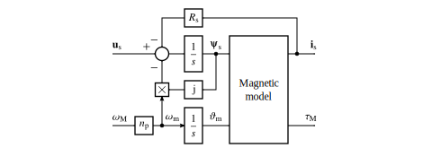

Electric Machines
=================

This document describes continuous-time electric machine models. 

Space Vectors
-------------

The machine models apply peak-valued complex space vectors, marked with boldface in the following equations. As an example, the space vector of the stator current is

.. math::
	\boldsymbol{i}^\mathrm{s}_\mathrm{s} = \frac{2}{3}\left(i_\mathrm{a} + i_\mathrm{b}\mathrm{e}^{\mathrm{j}2\pi/3} + i_\mathrm{c}\mathrm{e}^{\mathrm{j} 4\pi/3}\right) 
   :label: space_vector

where :math:`i_\mathrm{a}`, :math:`i_\mathrm{b}`, and :math:`i_\mathrm{c}` are the phase currents, which may vary freely in time. In our notation, the subscript s refers to the stator winding and the superscript s refers to the stationary coordinates. 

The space vector does not include the zero-sequence component, which is defined as

.. math::
	i_\mathrm{s0} = \frac{1}{3}\left(i_\mathrm{a} + i_\mathrm{b} + i_\mathrm{c}\right) 
   :label: zero_sequence

Even though the zero-sequence voltage exists at the ouput of typical converters (see :doc:`/model/converters`), there is no path for the zero-sequence current to flow, if the stator winding is either delta-connected or the star point is not connected, i.e., :math:`i_\mathrm{s0} = 0`. Consequently, the zero-sequence voltage produces neither power nor torque under. 

The space vector transformation in :eq:`space_vector` is implemented in the function :func:`motulator.abc2complex` and its inverse transformation in the function :func:`motulator.complex2abc`. 

Induction Machine
-----------------

The induction machine models are provided in the package :mod:`motulator.model.im`. The models are implemented in stator coordinates. A Γ-equivalent model is used as a base model since it can be extended with the magnetic saturation model in a staightforward manner [#Sle1989]_.

   Γ model.

   Block diagram of the machine model. The magnetic model includes the flux equations (or, optionally, saturation characteristics) and the torque equation.

The voltage equations are

.. math::
    \frac{\mathrm{d}\boldsymbol{\psi}_\mathrm{s}^\mathrm{s}}{\mathrm{d} t} &= \boldsymbol{u}_\mathrm{s}^\mathrm{s} - R_\mathrm{s}\boldsymbol{i}_\mathrm{s}^\mathrm{s} \\
    \frac{\mathrm{d}\boldsymbol{\psi}_\mathrm{r}^\mathrm{s}}{\mathrm{d} t} &= -R_\mathrm{r}\boldsymbol{i}_\mathrm{r}^\mathrm{s} + \mathrm{j}\omega_\mathrm{m}\boldsymbol{\psi}_\mathrm{r}^\mathrm{s}
    :label: im_voltage

where :math:`\boldsymbol{u}_\mathrm{s}^\mathrm{s}` is the stator voltage, :math:`\boldsymbol{i}_\mathrm{s}^\mathrm{s}` is the stator current, :math:`\boldsymbol{i}_\mathrm{r}^\mathrm{s}` is the rotor current, :math:`R_\mathrm{s}` is the stator resistance, and :math:`R_\mathrm{r}` is the rotor resistance. The electrical angular speed of the rotor is :math:`\omega_\mathrm{m} = n_\mathrm{p}\omega_\mathrm{M}`, where :math:`\omega_\mathrm{M}` is the mechanical angular speed of the rotor and :math:`n_\mathrm{p}` is the number of pole pairs. The stator flux linkage :math:`\boldsymbol{\psi}_\mathrm{s}^\mathrm{s}` and the rotor flux linkage :math:`\boldsymbol{\psi}_\mathrm{r}^\mathrm{s}`, respectively, are 

.. math::
    \boldsymbol{\psi}_\mathrm{s}^\mathrm{s} &= L_\mathrm{s}(\boldsymbol{i}_\mathrm{s}^\mathrm{s} + \boldsymbol{i}_\mathrm{r}^\mathrm{s} ) \\
    \boldsymbol{\psi}_\mathrm{r}^\mathrm{s} &= \boldsymbol{\psi}_\mathrm{s}^\mathrm{s} + L_\ell\boldsymbol{i}_\mathrm{r}^\mathrm{s} 
    :label: im_flux

where :math:`L_\mathrm{s}` is the stator inductance and :math:`L_\ell` is the leakage inductance. This linear magnetic model is applied in the class :class:`motulator.model.im.InductionMachine`. The electromagnetic torque is

.. math::
    \tau_\mathrm{M} = \frac{3 n_\mathrm{p}}{2}\mathrm{Im} \left\{\boldsymbol{i}_\mathrm{s}^\mathrm{s} (\boldsymbol{\psi}_\mathrm{s}^\mathrm{s})^* \right\}
    :label: im_torque

The class :class:`motulator.model.im.InductionMachineSaturated` extends the model with the main flux saturation, :math:`L_\mathrm{s} = L_\mathrm{s}(\psi_\mathrm{s})` [#Qu2012]_. See also the example :doc:`/auto_examples/vector/plot_vector_ctrl_im_2kw`.

.. note::
   If the magnetic saturation is omitted, the Γ model is mathematically identical to the inverse-Γ and T models. For example, the parameters of the Γ model can be transformed to those of the inverse-Γ model parameters as follows:

   .. math::
       L_\sigma &= \left(\frac{L_\mathrm{s}}{L_\mathrm{s} + L_\ell}\right)L_\ell \\
       R_\mathrm{R} &= \left(\frac{L_\mathrm{s}}{L_\mathrm{s} + L_\ell}\right)^2 R_\mathrm{r} \\
       L_\mathrm{M} &=  L_\mathrm{s} - L_\sigma 

   .. figure:: figs/im_inv_gamma.svg
      :width: 100%
      :align: center
      :alt: Inverse-Gamma model of an induction machine
      :target: .

      Inverse-Γ model.

   Example control methods in the package :mod:`motulator.control.im` are based on the inverse-Γ model.

Synchronous Machine
-------------------

A synchronous machine models is are provided in the package :mod:`motulator.model.sm`. The models can be parametrized to represent permanent-magnet synchronous machines (PMSMs) and synchronous reluctance machines (SyRMs). 

   Block diagram of the machine model in rotor coordinates. The magnetic model includes the flux equation (or, optionally, saturation characteristics) and the torque equation.

The voltage equation in rotor coordinates is [#Jah1986]_

.. math::
    \frac{\mathrm{d}\boldsymbol{\psi}_\mathrm{s}}{\mathrm{d} t} = \boldsymbol{u}_\mathrm{s} - R_\mathrm{s}\boldsymbol{i}_\mathrm{s} - \mathrm{j}\omega_\mathrm{m}\boldsymbol{\psi}_\mathrm{s} 
    :label: sm_voltage

where :math:`\boldsymbol{u}_\mathrm{s}` is the stator voltage and :math:`\boldsymbol{i}_\mathrm{s}` is the stator current. In the magnetically linear case, the stator flux linkage is 

.. math::
	\boldsymbol{\psi}_\mathrm{s} = L_\mathrm{d}\mathrm{Re}\{\boldsymbol{i}_\mathrm{s}\} + \mathrm{j}L_\mathrm{q}\mathrm{Im}\{\boldsymbol{i}_\mathrm{s}\} + \psi_\mathrm{f}
    :label: sm_flux 

where :math:`L_\mathrm{d}` is the d-axis inductance, :math:`L_\mathrm{q}` is the q-axis inductance, :math:`\psi_\mathrm{f}` is the permanent-magnet (PM) flux linkage. As special cases, this model represents a surface-PMSM with :math:`L_\mathrm{d} = L_\mathrm{q}` and SyRM with :math:`\psi_\mathrm{f}=0`.

The electromagnetic torque is

.. math::
    \tau_\mathrm{M} = \frac{3 n_\mathrm{p}}{2}\mathrm{Im} \left\{\boldsymbol{i}_\mathrm{s} \boldsymbol{\psi}_\mathrm{s}^* \right\}
    :label: sm_torque

Since the machine is fed and observed from stator coordinates, the quantities are transformed accordingly, as shown in the figure below. The mechanical subsystem closes the loop from :math:`\tau_\mathrm{M}` to :math:`\omega_\mathrm{M}`, see  :doc:`/model/mechanics`.

   Synchronous machine model seen from stator coordinates.

The linear magnetic model in :eq:`sm_flux` can be replaced with nonlinear saturation characteristics :math:`\boldsymbol{\psi}_\mathrm{s} = \boldsymbol{\psi}_\mathrm{s}(\boldsymbol{i}_\mathrm{s})`, either in a form of flux maps or explicit functions [#Hin2017]_. The generic saturation model is provided in the class :class:`motulator.model.sm.SynchronousMachineSaturated`. For its usage, see the examples :doc:`/auto_examples/obs_vhz/plot_obs_vhz_ctrl_pmsyrm_thor` and :doc:`/auto_examples/obs_vhz/plot_obs_vhz_ctrl_syrm_7kw`. Methods for importing and plotting the flux map data are also provided. 

.. rubric:: References

.. [#Sle1989] Slemon, "Modelling of induction machines for electric drives," IEEE Trans. Ind. Appl., 1989, https://doi.org/10.1109/28.44251.

.. [#Qu2012] Qu, Ranta, Hinkkanen, Luomi, "Loss-minimizing flux level control of induction motor drives," IEEE Trans. Ind. Appl., 2012, https://doi.org/10.1109/TIA.2012.2190818

.. [#Jah1986] Jahns, Kliman, Neumann, “Interior permanent-magnet synchronous motors for adjustable-speed drives,” IEEE Trans. Ind. Appl., 1986, https://doi.org/10.1109/TIA.1986.4504786

.. [#Hin2017] Hinkkanen, Pescetto, Mölsä, Saarakkala, Pellegrino, Bojoi, “Sensorless self-commissioning of synchronous reluctance motors at standstill without rotor locking, ”IEEE Trans. Ind. Appl., 2017, https://doi.org/10.1109/TIA.2016.2644624

