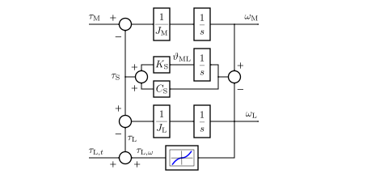

Mechanics
=========

Stiff Mechanics
---------------

The stiff rotational mechanics are governed by

.. math::
    J\frac{\mathrm{d}\omega_\mathrm{M}}{\mathrm{d} t} &= \tau_\mathrm{M} - \tau_\mathrm{L} \\
    \frac{\mathrm{d}\vartheta_\mathrm{M}}{\mathrm{d} t} &= \omega_\mathrm{M}
    :label: mech_stiff

where :math:`\omega_\mathrm{M}` is the mechanical angular speed of the rotor, :math:`\vartheta_\mathrm{M}` is the mechanical angle of the rotor, :math:`\tau_\mathrm{M}` is the electromagnetic torque, and :math:`J` is the total moment of inertia. The total load torque is

.. math::
    \tau_\mathrm{L} = \tau_{\mathrm{L},\omega} + \tau_{\mathrm{L},t}
    :label: load_torque

where :math:`\tau_{\mathrm{L},\omega}` is the speed-dependent load torque and :math:`\tau_{\mathrm{L},t}` is the external load torque as a function of time. One typical speed-dependent load torque component is viscous friction  

.. math::
    \tau_{\mathrm{L},\omega} = B\omega_\mathrm{M}
    :label: viscous_friction
    
where :math:`B` is the viscous damping coefficient. Viscous friction appears, e.g., due to laminar fluid flow in bearings. Another typical component is quadratic load torque

.. math:: 
    \tau_{\mathrm{L},\omega} = k\omega_\mathrm{M}^2\mathrm{sign}(\omega_\mathrm{M})
    :label: quadratic_load
    
which appears, e.g., in pumps and fans as well as in vehicles moving at higher speeds due to air resistance. The model of stiff mechanics is provided in the class :class:`motulator.model.Mechanics`. 

   Block diagram of the stiff mechanics.

Two-Mass System
---------------

The two-mass mechanics are governed by

.. math::
    J_\mathrm{M}\frac{\mathrm{d}\omega_\mathrm{M}}{\mathrm{d} t} &= \tau_\mathrm{M} - \tau_\mathrm{S} \\
    J_\mathrm{L}\frac{\mathrm{d}\omega_\mathrm{L}}{\mathrm{d} t} &= \tau_\mathrm{S} - \tau_\mathrm{L} \\
    \frac{\mathrm{d}\vartheta_\mathrm{ML}}{\mathrm{d} t} &= \omega_\mathrm{M} - \omega_\mathrm{L}
    :label: mech_two_mass

where :math:`\omega_\mathrm{L}` is the angular speed of the load, :math:`\vartheta_\mathrm{ML}=\vartheta_\mathrm{M}-\vartheta_\mathrm{L}` is the twist angle, :math:`J_\mathrm{M}` is the moment of inertia of the machine, and :math:`J_\mathrm{L}` is the moment of inertia of the load. The shaft torque is 

.. math::
    \tau_\mathrm{S} = K_\mathrm{S}\vartheta_\mathrm{ML} + C_\mathrm{S}(\omega_\mathrm{M} - \omega_\mathrm{L})
    :label: shaft_torque

where :math:`K_\mathrm{S}` is the torsional stiffness of the shaft, and :math:`C_\mathrm{S}` is the torsional damping of the shaft. The other quantities correspond to those defined for the stiff mechanics. Two-mass mechanics are modeled in the class :class:`motulator.model.MechanicsTwoMass`. See also the example in :doc:`/auto_examples/obs_vhz/plot_obs_vhz_ctrl_pmsm_2kw_two_mass`.

   Block diagram of the two-mass mechanical system.
