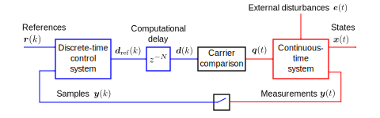

Generic System Model
====================

Sampled-Data Systems
--------------------

Machine drives and grid-connected converters are sampled-data systems, consisting
of continuous-time systems and discrete-time systems as well as the interfaces
between them [#Fra1997]_, [#Bus2015]_. The figure below shows a generic example
system. The same architecture is used in *motulator*.

   Block diagram of a sampled-data system. Discrete signals and systems are shown in blue, and continuous signals and systems are shown in red. 

The continuous-time system (named `mdl` in the provided example scripts) is the
model of a physical machine drive or grid converter system. The system comprises
a power converter along with other subsystem models depending on the application. The continuous-time system may have
external inputs, such as a load torque or power fed to a DC-bus of the converter.

The discrete-time controller (named `ctrl`) contains control algorithms, such as
the speed control and current control. The reference signals could be, e.g., the
speed and flux or voltage and power references. The feedback signal :math:`\boldsymbol{y}(k)`
typically contains the measured DC-bus voltage and stator/converter currents. 

Digital control systems typically have a computational delay of one sampling period,
:math:`N=1`. The PWM block shown in the figure models the carrier comparison,
see more details in :doc:`converters`. The carrier comparison is implemented in
the class :class:`motulator.common.model.CarrierComparison`. If the switching ripple
is not of interest in simulations, the carrier comparison can be replaced with zero-order hold (ZOH).

Space Vectors
-------------

The system models in *motulator* apply peak-valued complex space vectors, marked
with boldface in the following equations. As an example, the space vector of the
converter current is

.. math::
	\boldsymbol{i}^\mathrm{s}_\mathrm{c} = \frac{2}{3}\left(i_\mathrm{a} + i_\mathrm{b}\mathrm{e}^{\mathrm{j}2\pi/3} + i_\mathrm{c}\mathrm{e}^{\mathrm{j} 4\pi/3}\right) 
   :label: space_vector

where :math:`i_\mathrm{a}`, :math:`i_\mathrm{b}`, and :math:`i_\mathrm{c}` are
the phase currents, which may vary freely in time. In our notation, the subscript
c refers to the converter-side AC quantities and the superscript s refers to the
stationary coordinates. The space vector does not include the zero-sequence
component, which is defined as

.. math::
	i_\mathrm{c0} = \frac{1}{3}\left(i_\mathrm{a} + i_\mathrm{b} + i_\mathrm{c}\right) 
   :label: zero_sequence

Even though the zero-sequence voltage exists at the ouput of typical converters
(see :doc:`/model/converters`), there is no path for the zero-sequence current
to flow if the stator winding of a machine is delta-connected, or the star point
of the three-phase system is not connected, i.e., :math:`i_\mathrm{c0} = 0`.
Consequently, the zero-sequence voltage cannot produce neither power nor torque.

The space vector transformation in :eq:`space_vector` is implemented in the
function :func:`motulator.common.utils.abc2complex` and its inverse transformation
in the function :func:`motulator.common.utils.complex2abc`. 

.. rubric:: References

.. [#Fra1997] Franklin, Powell, Workman, "Digital Control of Dynamic Systems," Menlo Park, CA, USA: Addison-Wesley, 1997

.. [#Bus2015] Buso, Mattavelli, "Digital Control in Power Electronics," 2nd ed.,  Morgan & Claypool, 2015, https://doi.org/10.2200/S00637ED1V01Y201503PEL007
