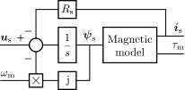

Synchronous Motor
=================

A continuous-time synchronous motor model is given in the module :mod:`motulator.model.sm`. The model can be parametrized to represent permanent-magnet synchronous motors (PMSMs) and synchronous reluctance motors (SyRMs). Peak-valued complex space vectors are used. 

   Block diagram of the motor model in rotor coordinates. The magnetic model includes the flux equation (or, optionally, saturation characteristics) and the torque equation.

The voltage equation in rotor coordinates is [1]_

.. math::
    \frac{\mathrm{d}\boldsymbol{\psi}_\mathrm{s}}{\mathrm{d} t} = \boldsymbol{u}_\mathrm{s} - R_\mathrm{s}\boldsymbol{i}_\mathrm{s} - \mathrm{j}\omega_\mathrm{m}\boldsymbol{\psi}_\mathrm{s} 

where :math:`\boldsymbol{u}_\mathrm{s}` is the stator voltage, :math:`\boldsymbol{i}_\mathrm{s}` is the stator current, and :math:`R_\mathrm{s}` is the stator resistance. The electrical angular speed of the rotor is :math:`\omega_\mathrm{m} = p\omega_\mathrm{M}`, where :math:`\omega_\mathrm{M}` is the mechanical angular speed of the rotor and :math:`p` is the number of pole pairs. In the magnetically linear case, the stator current is 

.. math::
	\boldsymbol{\psi}_\mathrm{s} = L_\mathrm{d}\mathrm{Re}\{\boldsymbol{i}_\mathrm{s}\} + \mathrm{j}L_\mathrm{q}\mathrm{Im}\{\boldsymbol{i}_\mathrm{s}\} + \psi_\mathrm{f} 

where :math:`L_\mathrm{d}` is the d-axis inductance, :math:`L_\mathrm{q}` is the q-axis inductance, :math:`\psi_\mathrm{f}` is the permanent-magnet (PM) flux linkage. As special cases, this model represents a surface-PMSM with :math:`L_\mathrm{d} = L_\mathrm{q}` and SyRM with  :math:`\psi_\mathrm{f}=0`. The electromagnetic torque is

.. math::
    \tau_\mathrm{M} = \frac{3p}{2}\mathrm{Im} \left\{\boldsymbol{i}_\mathrm{s} \boldsymbol{\psi}_\mathrm{s}^* \right\}

.. note::
    The linear magnetic model can be replaced with nonlinear saturation characteristics  :math:`\boldsymbol{i}_\mathrm{s} = \boldsymbol{i}_\mathrm{s}(\boldsymbol{\psi}_\mathrm{s})`, either in a form of explicit functions or look-up tables. The :class:`motulator.model.sm.SynchronousMotorSaturated` provides an example of a saturation model based on explicit functions [2]_.

Since the motor is fed and observed from stator coordinates, the quantities are transformed accordingly, as shown in the figure below. The mechanical subsystem closes the loop from :math:`\tau_\mathrm{M}` to :math:`\omega_\mathrm{m}`.

   Synchronous motor model seen from stator coordinates. The rotor angular position :math:`\vartheta_\mathrm{m}` is a state of the mechanical subsystem (see e.g. :class:`motulator.model.mech.Mechanics`).

References
----------

.. [1] Jahns, Kliman, Neumann, “Interior permanent-magnet synchronous motors for adjustable-speed drives,” IEEE Trans. Ind. Appl., 1986, https://doi.org/10.1109/TIA.1986.4504786

.. [2] Hinkkanen, Pescetto, Mölsä, Saarakkala, Pellegrino, Bojoi, “Sensorless self-commissioning of synchronous reluctance motors at standstill without rotor locking, ”IEEE Trans. Ind. Appl., 2017, https://doi.org/10.1109/TIA.2016.2644624

