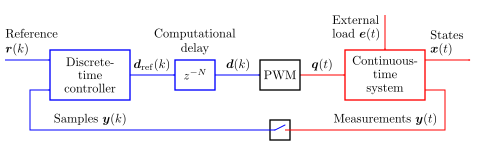

Drive System
============

Machine drives are sampled-data systems, consisting of continuous-time systems and discrete-time systems as well as the interfaces between them [Fra1997]_, [Bus2015]_. The figure below shows a generic example system. The same architecture is used in *motulator*.

   Block diagram of a sampled-data system. Discrete signals and systems are shown in blue, and continuous signals and systems are shown in red. 

The continuous-time system (named `mdl` in the :doc:`auto_examples/index`) is the model of a physical machine drive system, typically consisting of a machine, mechanics, and power converter. The continuous-time system may have external inputs, such as a load torque.

The discrete-time controller (named `ctrl` in the :doc:`auto_examples/index`) contains control algorithms, such as the current control and speed control. The reference signals could be, e.g., the speed and flux references. The feedback signal :math:`\boldsymbol{y}(k)` typically contains the measured DC-bus voltage and stator currents. 

Digital control systems typically have a computational delay of one sampling period, :math:`N=1`. This delay is modeled in the class :class:`motulator.simulation.Delay`. The PWM block shown in the figure models the carrier comparison, see more details in :doc:`converters`. The carrier comparison is implemented in the class :class:`motulator.simulation.CarrierCmp`. If the switching ripple is not of interest in simulations, the carrier comparison can be replaced with zero-order hold (ZOH).

References
----------

.. [Fra1997] Franklin, Powell, Workman, "Digital Control of Dynamic Systems," Menlo Park, CA, USA: Addison-Wesley, 1997

.. [Bus2015] Buso, Mattavelli, "Digital Control in Power Electronics," 2nd ed.,  Morgan & Claypool, 2015, https://doi.org/10.2200/S00637ED1V01Y201503PEL007
