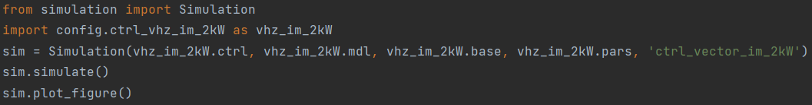

Usage
-----
The main folder includes the example script :mod:`sim` to run the simulation. The main folder script :mod:`main` uses the :mod:`simulation` class in order to simulate a model, plot the model figure or print the model configuration information. Optionally multiple simulation objects can be run in parallel (see :doc:`tutorial`). The folder :mod:`config` contains example configuration files that can be modified or used as templates for new ones. There are separate config files for the drive system (e.g. :mod:`config.mdl_im_2kW`) and for its controller (e.g. :mod:`config.ctrl_vector_im_2kW`). For example, pulse-width modulation (PWM) can be enabled in the drive system config file. The control system can be configured to operate in a sensorless or sensored mode.

The easiest way to use Motulator is to choose a config.ctrl file and import it, and then simulate and plot the figure of the simulation object as shown below.

The code is `print("statement")`